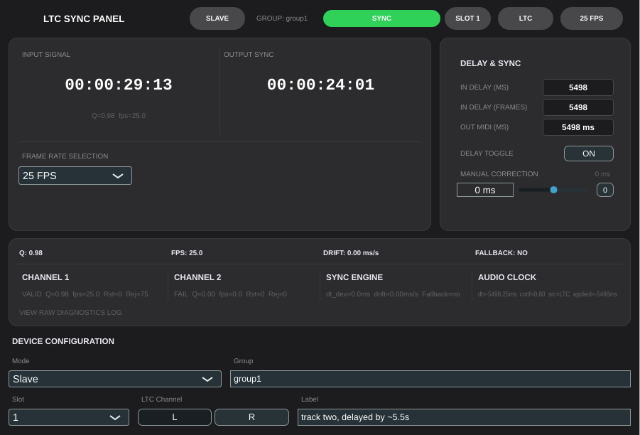

# AudioSync

**VST3 plugin** written in C++ using the JUCE framework. It automatically synchronizes multiple
360-degree camera recordings by decoding SMPTE LTC (Linear Time Code) timecode from audio
tracks, computing per-track delays, and applying them in real time. When LTC degrades or cuts
out, an audio-based fallback (Normalized Cross-Correlation on novelty curves) takes over
seamlessly.



## Architecture

The plugin runs in two roles that must be configured in the DAW session:

- **Master** — placed on the reference LTC track. Decodes LTC, extracts an audio novelty
  curve, and writes both to shared memory. Does not delay its own output.
- **Slave** — one instance per additional track. Reads master data from shared memory,
  decodes its own LTC, computes the inter-track delay, and applies it via a delay engine.
  Up to 8 slave instances are supported per group.

Both roles share a group name (set in the plugin UI) which identifies the shared-memory
region used for communication.

## Installation

Make sure the following are installed:

- [JUCE](https://juce.com/download/) — C++ framework for audio applications and plugins.
- [CMake](https://cmake.org/) 3.22+ and a C++17 compiler (Linux/macOS build).
- [Visual Studio 2022](https://visualstudio.microsoft.com) (Windows build).
- [Git](https://git-scm.com/) — version control.

Clone the repository:

```bash
git clone https://git.pg.edu.pl/p1334942/automatic-synchronization-of-sound-with-360-camera
```

### Build (Linux / macOS)

```bash
mkdir -p build && cd build
cmake ..
make
```

Output: `build/AudioSyncPlugin_artefacts/Release/VST3/`

### Build (Windows)

Open `AudioSync.jucer` in **Projucer**, export to Visual Studio 2022, then build from
the IDE or:

```bash
msbuild "Builds/VisualStudio2022/AudioSync.sln"
```

## Usage

1. In your DAW, load the VST3 on the reference LTC track. Set its role to
  **Master** and choose a group name.
2. Load a second instance on each additional track. Set its role to **Slave**
   and use the same group name.
3. Press play. The master displays the decoded timecode (HH:MM:SS:FF). Each
   slave displays its computed delay in milliseconds and frames, and applies the
   delay automatically.
4. A manual correction slider is available on each instance for fine-tuning.
5. When LTC quality drops (Q_LTC < 0.5), the plugin transparently switches to
   audio-based delay tracking. The diagnostics card shows the active source (LTC
   / AUD / NONE).

## Authors and Acknowledgements

- Dr. Bartłomiej Mróz - problem diagnosis and formulation, supervision and
  guidance
- Filip Lewinski - author
- Tsimafei Dalhou - initial work on LTC decoding and synchronization via delay
